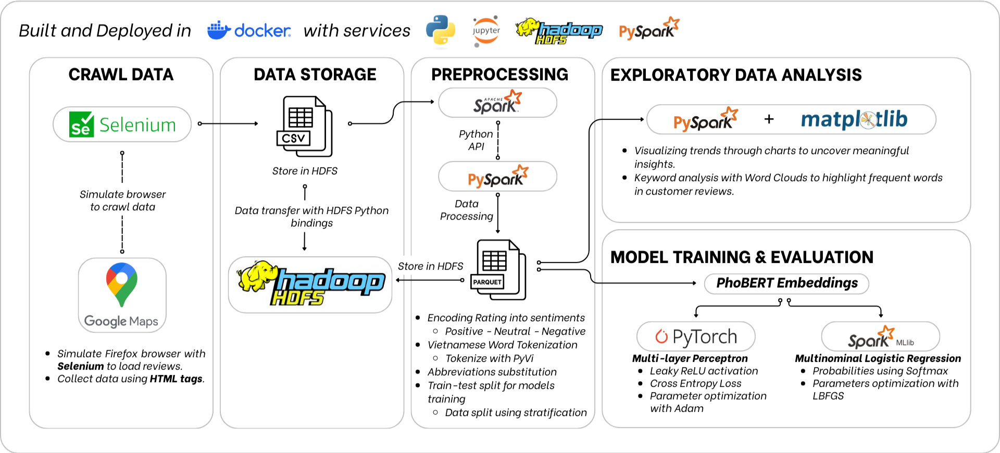

# Sentiment Analysis on KFC reviews from Google Maps
This is a group project on Sentiment Analysis using Big Data framework Apache Hadoop and Apache Spark. For ease of deployment, we opt for a multi-container Docker application to install the necessary services: Hadoop, Spark, Python and Jupyter.\
The project aims to develop a classification model on general comments about the KFC fast-food chain. In order to train the model, we crawled reviews from multiple KFC locations within Hồ Chí Minh city on Google Maps.

#### Table of Contents
- [**Overview**](#overview)
    - [Deploying the Docker Application](#docker_deploy)
    - [Crawling Reviews from Google Maps](#reviews_crawl)
    - [Processing data with PySpark](#reviews_store)
    - [Model Training and Evaluation](#models)
- [**Results and Dicussion**](#results-and-discussion)
- [**Acknowledgements**](#acknowledgements)
- [**References**](#references)

## Overview
The whole project can be best explained by the following figure:

*Figure: The project's overall workflow*

<b>Deploying the Docker Application</b>

Taking advantage of pre-built Docker images, we opt for multi-container Docker application for quick deployment of the working environment.\
In the application, we deploy two images provided by [`big-data-europ/docker-hadoop`](https://github.com/big-data-europe/docker-hadoop). These images are responsible for the Hadoop HDFS service within the project.\
For processing with Spark, we use the official [`jupyter/pyspark-notebook`](https://hub.docker.com/r/jupyter/pyspark-notebook) image. The latest image has Python 3.11.6 installed with PySpark. The image also hosts a local JupyterLab session where one can easily connect to from outside of the Docker container.

For more information on the application, see [`docker-hadoop/README.md`](./docker-hadoop/README.md)
To see how one deploys, runs as well as connecting to the JupyterLab instance, visit [`how_tos.ipynb`](how_tos.ipynb).

<b>Crawling Reviews from Google Maps</b>

After setting up the application, we then began the core of the project. The first task of which we need to do is to find a way to collect reviews from places on Google Maps.

Google themselves provide a [Google Places API](https://developers.google.com/maps/documentation/places/web-service/overview) for retrieving multiple types of data about a place on Google Maps including reviews. However, this is meant as a freemium service and the quota is relatively low compare to our needs. Furthermore, you need to to set up a billing account in order to use the API, which is also slightly inconvenient for us.

Thus, the only option left is to resort to crawling data straight from the site. Because the site is not static by nature, we uses [selenium](https://pypi.org/project/selenium/) to simulate certain loading functionalities and interactions within the website. We provide the crawling code packaged in a class wrapper `ReviewCrawler` provided in [ggplace_review_crawler](./review_crawl/ggplace_review_crawler/). For more information on how to use the package, see [README.md](./review_crawl/README.md).

While crawling, we immediately save the results to the HDFS using the Python API [hdfs](https://hdfscli.readthedocs.io/en/latest/).

<b>Processing data with PySpark</b>

[Apache Spark](https://spark.apache.org/) is a framework for processing big data with distributed computing. Spark allows seamless integration with multiple big data storage infrastructures like the HDFS we have deployed as well as analytics and science computing frameworks like R, NumPy, etc. In this project, we utilise the Spark's API for Python called [PySpark](https://spark.apache.org/docs/latest/api/python/index.html) to do any data processing.

More specifically, we deploy PySpark through the prebuilt Docker image [jupyter/pyspark-notebook](https://hub.docker.com/r/jupyter/pyspark-notebook). This image allows you to host a local JupyterLab session with pre-installed libraries necessary for processing with PySpark, allowing an easy deployment. When doing data processing, you can connect to the server from a Jupyter notebook or work within the Web UI. For instructions and demonstrations on this subject, see the `Executing Python scripts within the application` and `Accessing HDFS from PySpark Session` sections in [`how_tos.ipynb`](how_tos.ipynb).

<b>Model Training and Evaluation</b>

For classification models, we chose to train a Logistic Regression model and a simple Multi-layer Perceptron neural network. The details of how models are trained are discussed in [`sentiment_analysis/README.md`](./sentiment_analysis/README.md).

However, because our dataset are quite imbalanced, especially with neutral reviews, we decided to compare models using class-wise metrics. More specifically, we compute precision, recall and F1 measure for each class and compare both models. The full results can be found in [`sentiment_analysis/model_eval.ipynb`](./sentiment_analysis/model_eval.ipynb).

## Results and Discussion
We proceeded to run inference on two data: the test set from our dataset and a few comments we collected manuall on Foody.

The results on test set shows both model to have equal performance at detecting positive and negative reviews, shown by a difference in F1 meassure of only around 3%. Further inspection shows that the multi-layer perceptron has higher precision, making its predictions more reliable than that of the Logistic Regression model. However, the Logistic Regression model compensates in recall, able to detect more negative reviews. For neutral reviews, the Logistic Regression model has no ability to distiniguish this. On the other hand, the multi-layer perceptron can correctly identify some neutral reviews, but a recall of around 50% show that it performs no better than random guessing for these reivews.

Afterwards, we tested out both models on a few comments posted on [Foody](https://www.foody.vn/ho-chi-minh/kfc-ly-thuong-kiet/binh-luan). Both models agree on all comments except for one comment. In more details, multi-layer perceptron identify this comment to be neutral, where Logistic Regerssion identify it to be positive. Checking the content of the comment, we found the comment to contain both criticisms and positive feedback. Furthermore, the reviews contain words like `"ổn"`, `"khá"` and `"oke"`, which is quite typical of the 3-star reviews we have collected on Google Maps. These features gives insight onto why multi-layer perceptron identified it as a neutral review, suggesting that the model could capture these subtle details.

In summary, the good performance on detecting positive and negative reviews in both models suggests that they can effectively use the embeddings created by PhoBERT, and that these embeddings are suitable for this classification task. We found this to be typical of BERT-based models, where hidden contexts and subtle relationships between words can be captured by the encoder-only transformer. However, the hindrance in neutral reviews can be best explained by the low-quality samples in the dataset as well as the shortage of neutral reviews. Based on this, we give the following suggests for future work:
- Manually labelling the reviews: to ensure quality on neutral reviews, as well as other reviews, we suggest manually checking the content of reviews after bucketizing them into positive, neutral and negative classes like we did during preprocessing.
- Crawling reviews from other sites: we have noticed that while people provide lots of reviews on Google Maps, most reviews usually conists of a single word or no content at all. Even though we crawled from a total of 20 places, only around 4000 reviews were actually crawled, giving an average of only 200 reviews per place.
- Along with reviews, we have also found photos posted by users. Due to time constraints, we did not invest much into crawling these photos. However, we speculate that these photos can also help provide information on the semantics of the reviews.
- Finally, during the training of multi-layer perceptron, we have only tested out a few learning rates and did not do an exhaustive search on them. Furthermore, we did not tune the betas used in Adam and decided to use the recommended numbers. More exhaustive method of tuning these hyperparameters might increase the model performance.

## Acknowledgements
## References
### Our contributors:

