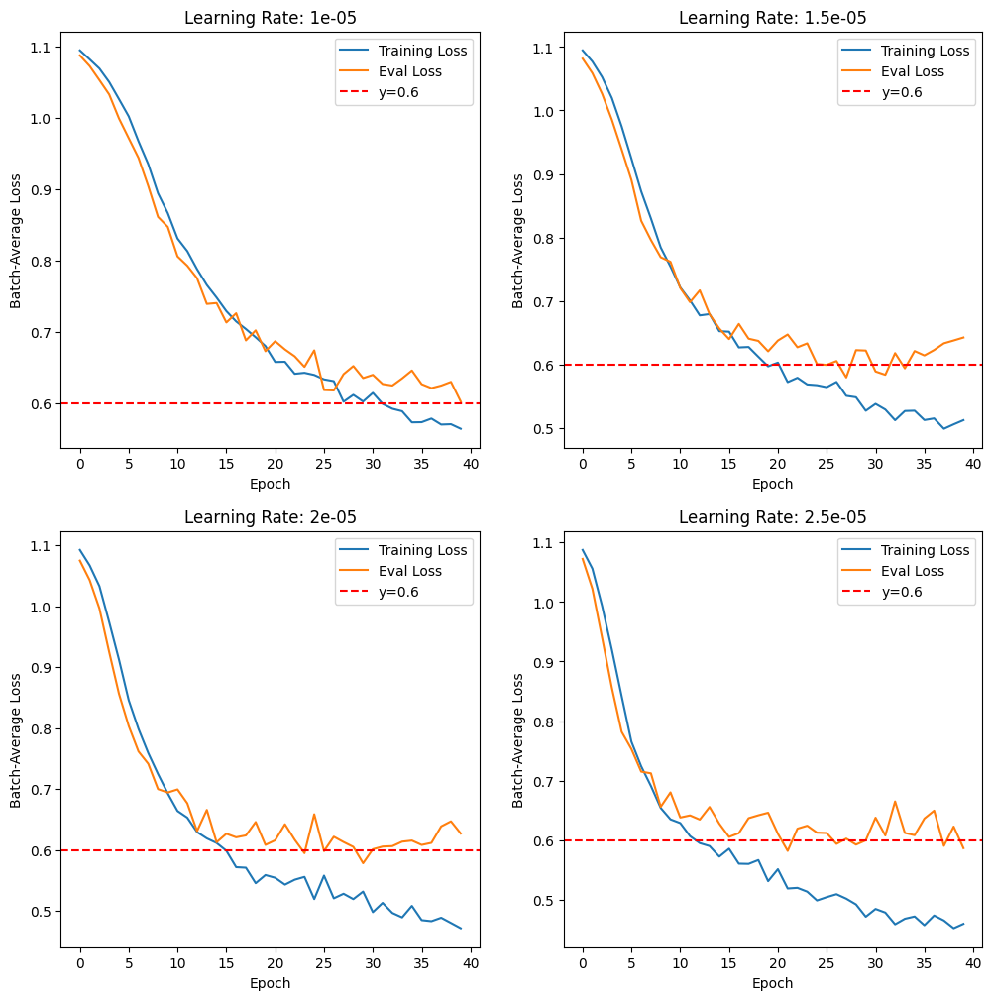

# Core - Sentiment Anlysis
This is the core of the project where data preprocessing, model training and data anlytics are done. The preprocessing and data analytics are mostly done with Spark. For ML models, we utilise Spark's built in MLlib as well as PyTorch for Deep Learning models.\
For information on how to install PyTorch as well as how to set up GPU resources for the Docker application to use, see []().

This section includes:
- [Preprocessing](#preprocessing)
- [EDA](#eda)
- [Model Training](#model-training)

## Preprocessing
As mentioned, the whole project will process data using Spark, more specifically Python API for Spark called [PySpark](https://spark.apache.org/docs/latest/api/python/index.html). The preprocessing steps include:
1. Bucketizing rating scores (1-5) into sentiments (positive, neutral, negative) for model training. Ratings above 3 stars are consider positive, below 3 stars are considered negative and neutral otherwise.
2. Vietnamese word tokenization using [PyVi](https://github.com/trungtv/pyvi)'s tokenizer.
3. Replacing abbreviated words with its full form.

After preprocessing, the data is saved back into the HDFS for data anlytics. Furthermore, to create convenience for model training, the preprocessed data is also splitted into train and test set using stratification and saved into HDFS.

## EDA
After preprocessing, we went ahead and do a little analysis on the data. This is present within [`eda.ipynb`](eda.ipynb).

We drew several graphs to demonstrate the relationship between each places and the ratings.\
We also demonstrate the relationship between the words and sentiments through serveral word clouds.

## Model Training
We present two models that both uses [PhoBERT](https://github.com/VinAIResearch/PhoBERT) to create embeddings for reviews. Like most text classification model, we only use the output of the `[CLS]` token for classification and discard the rest.

For the Logistic Regression model, we utilize the LogisticRegression module given in Spark's [MLlib](https://spark.apache.org/docs/latest/ml-guide.html). However, for the neural network, we use PyTorch to build the Multi-layer Perceptron. Even though MLlib does provide a MLP model, the model does not allow for customization with activation functions, optimization algorithms,...

With the MLP, we first try out some activation functions like Sigmoid and ReLU and decided to stick with LeakyReLU with 0.02 negative slope. We also tried out various number of hidden layers and found that around 2 hidden layers had the best convergence. However, we did not experiment much with the width of the hidden layers.

From there on, we test out for some learning rates using Adam algorithm and found that a learning rate of $1.5\cdot10^{-5}$ had the best convergence. The search was done by running around 10-20 epochs for some inital values and then run 50 epochs on the values we found most potential. However, due to time contraints, the best we could stick to was $1.5\cdot10^{-5}$.\
Although, we speculate that some value between $1\cdot10^{-5}$ and $1.5\cdot10^{-5}$ would be better.

<div align='center'>
    
</div>

For results and discussion of the models, please see [`model_eval.ipynb`](./model_eval.ipynb) or [`README.md`](../README.md)

---
---
## Installing PyTorch and Sharing GPU resources to Docker Container
If you want to test some stuff out with the DL models, there are two things you need to note:
### 1. Sharing GPU resources with Docker container
If want to use PyTorch inside of the Docker application with GPU resource, you need to head over to [docker-hadoop/docker-compose.yml](../docker-hadoop/docker-compose.yml) and change a few things. Go to the `spark-notebook` service and insert the following attribute:
```yaml
service:
  spark-notebook:
    ...
    deploy:
      resources:
        reservations:
          devices:
            - driver: nvidia
              device_ids: ['0']
              capabilities: [gpu]
```

This will enable access for the `spark-notebook` container to your GPU resource by making a reservation to the correpsonding device. Depending on your GPU, you may need to change your `driver` value as well as `device_ids` to better suit your case. You can read more information [here](https://docs.docker.com/compose/how-tos/gpu-support/).

### 2. Installing PyTorch
To install PyTorch, you can just run:
```bash
pip install torch
```
However, if you intend to use your GPU for PyTorch's computations, please visit [here](https://pytorch.org/get-started/locally/) and choose the suitable options for your machine. This is very vital in order for torch's computations on GPU to work.